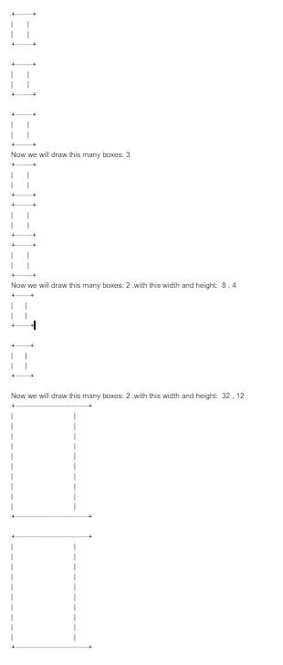

Created 9/8/20 to following TEALS 1.05

Class DrawBoxes3 is a superset of the instruction.

Method drawbox() matches instruction and the main method up until "More Fun below" except that methods were shown with and without their default class name.

Section starting ?/More fun below uses methods in a second class with some flexibility including loops

Result of running program as is:

  

